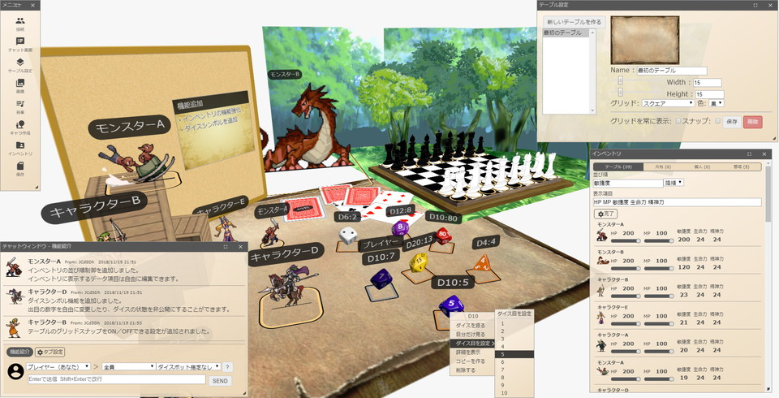

# Udonarium Daphne

Udonarium Daphne は、Udonarium をベースにしたブラウザ動作のオンラインセッション支援ツールです。
軽量なオンライン卓の操作感を保ちながら、GM向けの秘匿管理、バフ/デバフ管理、リソース操作コマンド、ローカル環境からの一時公開機能を追加しています。

バージョン: `0.1.12`

状態: 公開前プレビュー



## 主な機能

- ブラウザ上で動作するオンライン卓
- キャラコマ、カード、ダイス、チャット、チャットパレット、共有メモ、マスク、地形、ルーム保存/読込
- SkyWay 2023 対応
- SkyWay トークン発行用バックエンド連携
- HTTPS ローカル起動
- Cloudflare Quick Tunnel による一時公開用バッチ
- 任意切り替え式のGMモードとGM作成キャラクターの閲覧制限
- キャラクターごとのステータス秘匿
- バフ/デバフとラウンド管理
- ラウンド中のキャラクター行動完了チェック
- キャラクターに紐づくバフ/デバフテンプレート
- キャラzip出力時のテンプレート/付与中効果の同梱
- BCDice 風の四則演算を使ったリソース操作コマンド
- ラウンド変更時のメインチャット通知と、各チャットへのラウンド注釈
- タブ切り替え式のヘルプページ

## Daphne で追加した要素

### GMモード

GMモードは接続状態やルーム作成者に依存せず、接続情報パネルから任意に切り替えます。有効化時には、秘匿中のステータスやGM向けチャット内容が見える状態になることを確認してからONにします。

GMが作成したキャラクターは、非GMユーザーから詳細表示やチャットパレット選択ができないように制限できます。GMがzipから追加したキャラクターも、GM作成キャラクターとして扱われます。

### ステータス秘匿

キャラクターごとにステータス秘匿フラグを設定できます。秘匿中のキャラクターは、非GMユーザーの画面ではマウスオーバー時のステータス表示、インベントリ上の簡易ステータス、リソース操作コマンドのチャット表示などが `??` になります。

GMユーザーには秘匿中の値も通常どおり表示されます。

### バフ/デバフとラウンド

キャラクターに対して、以下のような効果を管理できます。

- 対象ステータス
- 加算、減算、乗算、除算、半減などの効果
- 自由記述の効果
- 残りラウンド数

ルーム全体のラウンドを進めると、付与中の効果時間が自動で減少します。残りラウンドが0になった効果は削除されます。
ラウンド操作はGMモード中のユーザーのみ実行できます。

ラウンド中は、各キャラクターのチャットパレットまたはキャラコマの右クリックメニューから行動完了を切り替えられます。盤面上の名前横には常に行動状態アイコンが表示され、未行動はグレー、完了済みはチェックマークになります。行動完了時はメインチャットにもログが流れます。ラウンドが0の時は行動完了表示は出ません。ラウンドが1以上の時は、テーブル上の全キャラクターが行動完了になるまで次ラウンドへ進めません。

キャラクターごとにバフ/デバフテンプレートを登録でき、UIまたはチャットコマンドから実行できます。キャラzipとして保存した場合、そのキャラクターに紐づくテンプレートと付与中効果も一緒に保存され、読み込み時に新しいキャラクターへ紐づけ直されます。

### リソース操作コマンド

リソース操作コマンドでは四則演算を利用できます。先頭に `:` を付けると、続くリソース値へ BCDice による計算結果を反映します。半角スペースで区切ると複数コマンドを処理でき、先頭から連続する `:` コマンド以外はコメントとして残せます。

書式例:

```text
:リソース名 式
```

具体例:

```text
:HP-10+5
```

この場合は `HP-5` として扱われます。

最大値を超えないようにするオプションや、与える値が0以下にならないようにするオプションも利用できます。

## 必要環境

- Node.js
- npm
- Google Chrome、Microsoft Edge、Firefox などのモダンブラウザ
- SkyWay/WebRTC を利用する場合は HTTPS 環境

## セットアップ

依存パッケージをインストールします。

```bash
npm install
```

一時公開用バッチを使う場合は、環境変数ファイルを作成します。

```bat
copy .env.public.example .env.public
```

`.env.public` に SkyWay の値を設定します。

```env
SKYWAY_APP_ID=your-skyway-application-id
SKYWAY_SECRET_KEY=your-skyway-secret-key
SKYWAY_LOBBY_SIZE=4
PORT=4200
CLOUDFLARED_PROTOCOL=http2
```

`.env.public` は秘密情報を含むため、Git管理対象外です。

## ローカル起動

HTTPS のローカルサーバーで起動します。

```bash
npm run serve:local
```

通常は以下のURLで開きます。

```text
https://127.0.0.1:4200/
```

ポートが使用中の場合は、空いている別ポートが使われます。実際のURLは起動時のターミナル表示を確認してください。

## 外部向け一時公開

Cloudflare Quick Tunnel を使って、ローカルPC上の Udonarium Daphne を一時的に公開できます。

事前に `cloudflared` をインストールします。

```bash
winget install --id Cloudflare.cloudflared
```

その後、以下を実行します。

```bat
start-public-cloudflare.bat
```

起動後、ターミナルに `PUBLIC URL:` として以下のようなURLが表示されます。

```text
https://example.trycloudflare.com/
```

このURLを参加者に共有すると、外部ユーザーも接続できます。現在の公開URLは `public-url.txt` にも保存されます。

注意:

- Quick Tunnel のURLは起動するたびに変わります。
- 以前共有した `trycloudflare.com` のURLは、トンネル停止後に無効になります。ブラウザで `DNS_PROBE_FINISHED_NXDOMAIN` が出る場合は古いURLを開いている可能性が高いため、バッチを起動し直して新しい `PUBLIC URL` を共有してください。
- 公開中はURLを知っているユーザーがアクセスできます。
- セッション終了後はバッチまたは `cloudflared` を停止してください。

## Cloudflare Pages + Functions

常設公開する場合は Cloudflare Pages + Functions で、静的なアプリ本体と SkyWay トークン発行 API を同一ドメインに配置できます。

- Build command: `npm run build:pages`
- Build output directory: `dist/udonarium-daphne`
- Functions directory: `functions`
- 必須環境変数: `SKYWAY_APP_ID`, `SKYWAY_SECRET_KEY`

詳しい手順は [CLOUDFLARE-PAGES.md](CLOUDFLARE-PAGES.md) を参照してください。

## 開発

Angular の開発サーバーを起動します。

```bash
npm start
```

開発用ビルドを実行します。

```bash
npm run build -- --configuration development
```

Cloudflare Pages 向けの本番ビルドを実行します。

```bash
npm run build:pages
```

## リポジトリ

https://github.com/Kiira1925/Udonarium_Daphne

## Credits

Udonarium Daphne は Udonarium をベースにしています。

- Original Udonarium: https://github.com/TK11235/udonarium
- BCDice: https://github.com/bcdice/bcdice-js
- SkyWay: https://skyway.ntt.com/

## License

MIT License. See [LICENSE](LICENSE).
